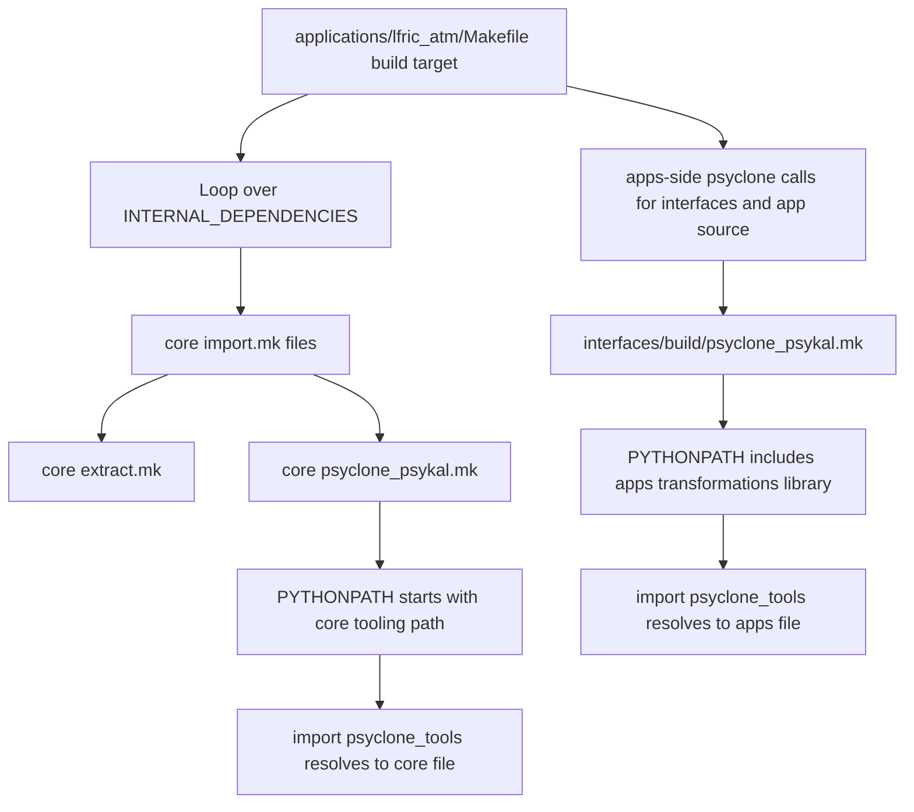
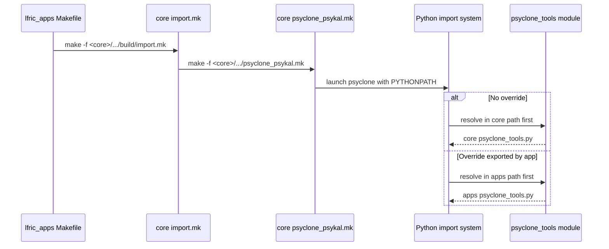

# Dealing with Internal Dependencies

## Purpose

This note explains how to make PSyclone transformations used by internal dependencies (from lfric_core) resolve to the lfric_apps transformation library, while keeping core defaults intact.

## Current Situation

- The lfric_atm build triggers internal dependency imports through core import.mk files.
- Those imports call core PSyclone machinery.
- Core PSyclone prepends its own tooling path first, so imports like `from psyclone_tools import ...` resolve to the core module.
- App and interface sources already use the apps-side PSyclone makefile and apps transformation path.

## Why This Matters

- You can evolve transformations in one place in this repository.
- You avoid accidental divergence between similarly named helper modules.
- You can test and release app-specific transformation behavior without forcing immediate core changes.

## Dependency Direction: What Is and Is Not Allowed

The override pattern is intentionally one-way and optional:

- app builds may export `CORE_PSYCLONE_TOOL_LIB`
- core PSyclone makefiles may read that variable if present
- if the variable is absent, core falls back to its own default tooling path

This does not create a dependency from `lfric_core` to `lfric_apps`.

It is safe only if the core code uses a default value, for example:

- `CORE_PSYCLONE_TOOL_LIB ?= $(LFRIC_BUILD)/psyclone`

and then uses that variable in the PSyclone command. In other words, the core remains self-contained and app-specific configuration is an override, not a required import path.

The pattern to avoid is any hard-coded reference from core to a path under the apps tree, such as a literal `$(APPS_ROOT_DIR)` in the core makefile. That would make the core build dependent on this repo.

## Build Flow at a Glance



## Recommended Migration Strategy

1. Add an overridable variable in core PSyclone makefile for the tools path.
2. Keep the default pointing to core tooling so core-only workflows remain unchanged.
3. Export the override from lfric_apps application makefiles.
4. Validate with one app (lfric_atm), then roll out to others.

## Control-Point Diagram



## lfric_apps-Side Change Implemented Here

The following was implemented in lfric_apps:

- Export `CORE_PSYCLONE_TOOL_LIB` from lfric_atm Makefile, pointing at:
  - `$(APPS_ROOT_DIR)/interfaces/psyclone_transformations_library/psykal_tools`

This prepares lfric_atm to drive core PSyclone imports from apps tools once the core makefile supports the override variable.

## Core Change Still Needed

A small core change is still required to consume the override:

- In core psyclone_psykal.mk, define:
  - `CORE_PSYCLONE_TOOL_LIB ?= $(LFRIC_BUILD)/psyclone`
- Replace hardcoded:
  - `PYTHONPATH=$(LFRIC_BUILD)/psyclone:$$PYTHONPATH`
- With:
  - `PYTHONPATH=$(CORE_PSYCLONE_TOOL_LIB):$$PYTHONPATH`

This preserves existing defaults while enabling app-controlled override.

This is the correct dependency boundary:

```mermaid
flowchart LR
    A[App build] --> B[export CORE_PSYCLONE_TOOL_LIB]
    B --> C[Core PSyclone invocation]
    C --> D{Variable defined?}
    D -->|No| E[Use default: $(LFRIC_BUILD)/psyclone]
    D -->|Yes| F[Use app override: $(APPS_ROOT_DIR)/interfaces/psyclone_transformations_library/psykal_tools]
    E --> G[Core remains self-contained]
    F --> H[App opts in to a custom transformation library]
```

This makes the override optional and reversible; it is not a requirement for core to import anything from the app repository.

## Verification Plan

1. Build lfric_atm with a transformation that imports from psyclone_tools.
2. Add temporary diagnostics in one optimisation script:
   - `import inspect, psyclone_tools`
   - `print(inspect.getsourcefile(psyclone_tools))`
3. Confirm resolved path points into lfric_apps interfaces/psyclone_transformations_library.
4. Remove diagnostics and re-run.

## Rollout Guidance

- After validating lfric_atm, apply the same app-side export to other app makefiles that pull core internal dependencies.
- Keep path construction via APPS_ROOT_DIR to avoid dependence on launch directory.
- Prefer one canonical psyclone_tools implementation in apps for app-managed transformations.
